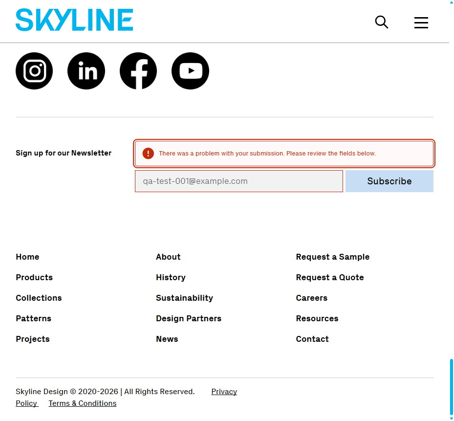

# BUG-002: Newsletter form rejects valid email with generic error message

**Test Case:** TC-MAINPAGE-NEWSLETTER-001
**Feature:** main-page-input-forms
**Flow:** newsletter-signup
**Priority:** Critical
**Severity:** High
**Date Found:** 2026-09-23
**Source Report:** reports/main-page-input-forms-2026-07-23

## Description
The newsletter signup form in the footer rejects a syntactically valid email address ("qa-test-001@example.com") with a generic error message, "There was a problem with your submission. Please review the fields below." This blocks users from subscribing to the newsletter with legitimate email addresses, preventing a key marketing feature from functioning.

## Steps to Reproduce
1. Scroll to the footer newsletter signup form (Gravity Forms #5)
2. Enter "qa-test-001@example.com" into the email field
3. Submit the form

## Expected Result
Form submits successfully and a confirmation/success message is displayed to the user; no error is shown.

## Actual Result
Attempt 1: Scrolled to footer newsletter signup form, entered "qa-test-001@example.com" into the email field, clicked Subscribe. Form re-rendered with heading "There was a problem with your submission. Please review the fields below." and the email field marked invalid, despite a syntactically valid email. Attempt 2 (retry): repeated the same steps from a fresh page load with the same email value — identical failure occurred (same error heading, email field marked invalid again). No console errors were logged; the only network-adjacent element present is the reCAPTCHA v3 iframe, consistent with a possible bot-score rejection, but this was not confirmed via network inspection.

## Screenshot

## Environment
- Environment: dev
- URL: https://dev.skyline.glass/
- Browser: Playwright default chromium

## Console Errors
None recorded during execution.

## Notes
- Reproducible on two consecutive attempts from fresh page loads.
- The email syntax is fully compliant with RFC 5322 standards.
- Per the linked test case's precondition, the form is protected by invisible reCAPTCHA v3 and posts to a live Gravity Forms backend; automated submissions may receive a low bot score and be silently blocked, which may be the root cause rather than a form-validation defect per se.
- A near-identical bug (BUG-001, same TC-ID, same failure signature) already exists on branch `bug/main-page-input-forms-2026-07-23`, but that branch's PR (#3) was closed without merging into `bugs`. This report is filed as a fresh BUG-002 per explicit instruction; the two likely describe the same underlying defect and should be reconciled/deduplicated by a human before both are actioned.
