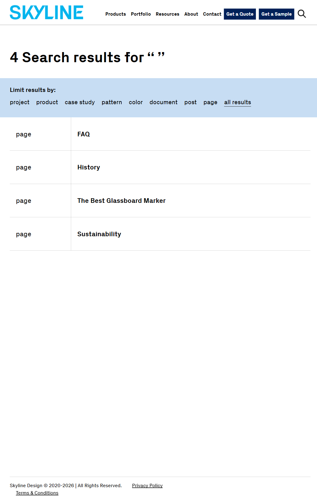

# BUG-003: Whitespace-only search query is not treated as empty

**Test Case:** TC-MAINPAGE-SEARCH-005
**Feature:** main-page-input-forms
**Flow:** header-search
**Priority:** Medium
**Severity:** Medium
**Date Found:** 2026-09-24
**Source Report:** reports/main-page-input-forms-2026-09-24-143727

## Description
Submitting a whitespace-only query in the header search form is not treated as an effectively empty query. Instead it is accepted as a distinct query and returns a different (and misleading) result set. No crash or server error occurs, but the expected empty/no-query handling is not applied.

## Steps to Reproduce
1. Click into the header search field
2. Enter "   " (whitespace only) as the query
3. Submit the search form

## Expected Result
Form treats the query as effectively empty — either blocks submission or shows an appropriate empty/no-query results state; no page crash or server error.

## Actual Result
Whitespace-only query ('   ') submitted; navigated to /?s=+++ and returned a distinct "4 Search results for \" \"" state (different result set than the true empty-query case, which returns 716 results). Behavior was reproduced identically on retry (consistent, not flaky). No crash/server error, but whitespace is not treated as effectively empty as required.

## Screenshot

## Environment
- Environment: dev
- URL: https://dev.skyline.glass/
- Browser: Playwright default chromium

## Console Errors
None
